# my-portfolio-app

This is a personal portfolio web app built using **Laravel**, **Vue 3**, **Tailwind CSS**, and **Vite**.  
It showcases skills, projects, and contact information, styled with a modern dark-themed UI.

---

## 🔧 Technologies Used

- **Laravel** — Backend framework for routing, blade rendering, and API handling.
- **Vue 3** — Frontend framework with `<script setup>` syntax.
- **Tailwind CSS** — Utility-first CSS framework for responsive design.
- **Vite** — Fast frontend bundler for development and production.
- **Font Awesome** — Icons used throughout the interface.

---

## 📁 Features

- 💻 Clean, responsive layout matching designer portfolio styles.
- ✨ Card-style fixed header with navigation and "Hire Me" button.
- 🧑‍💼 Hero section with:
  - Name and title
  - Description (formatted in paragraphs with highlights)
  - Contact info and social links
  - Circular profile image with badge

---

## 🖼️ Screenshots

### 🔹 Home
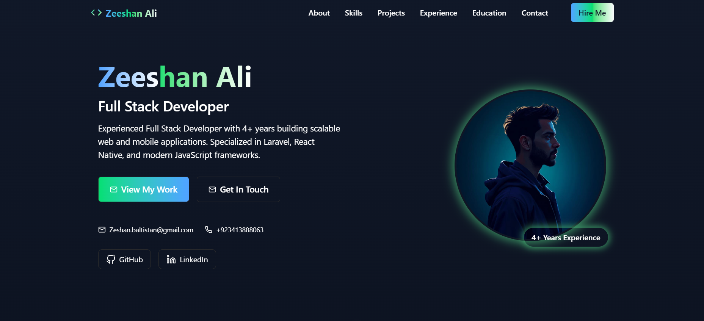

### 🔹 Skills
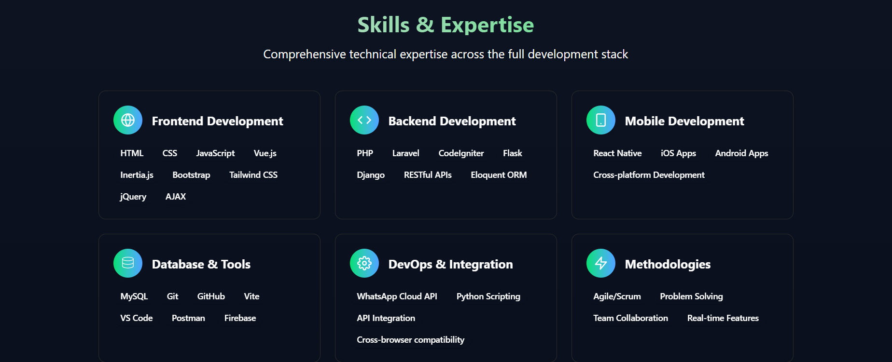

### 🔹 Projects
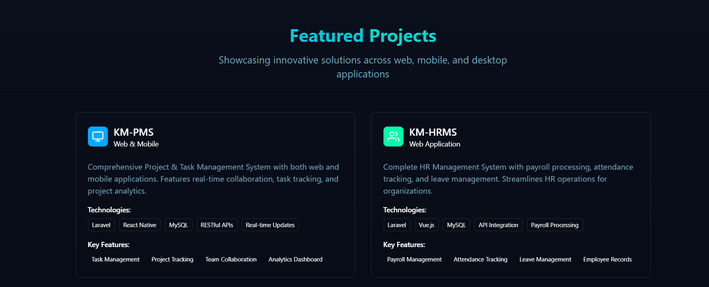  
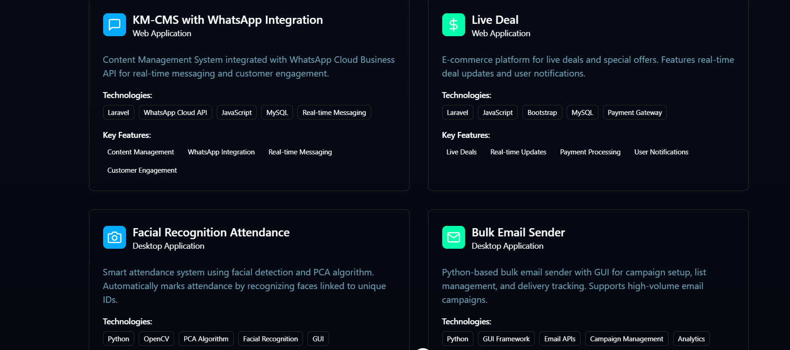  
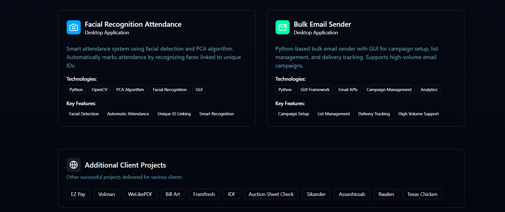

### 🔹 Experience
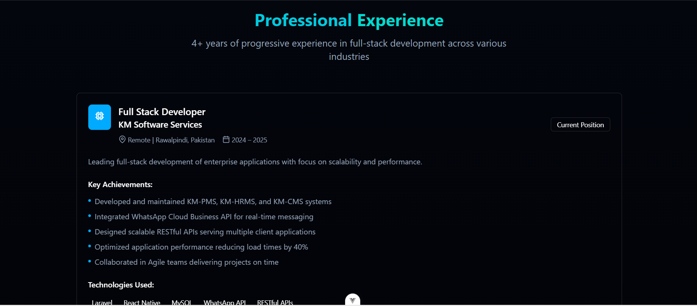  
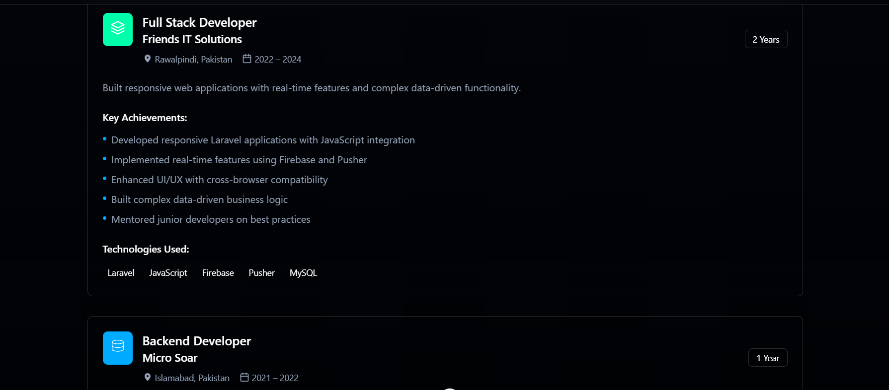  
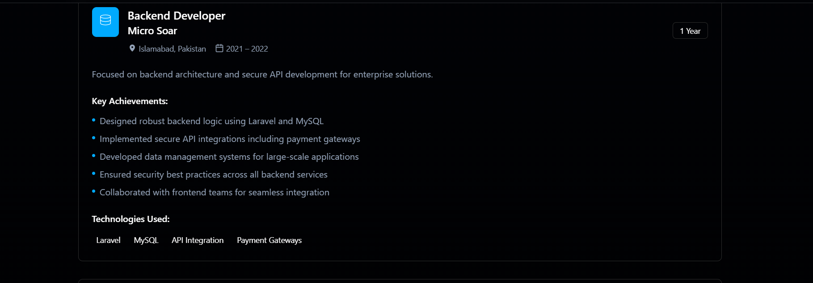  
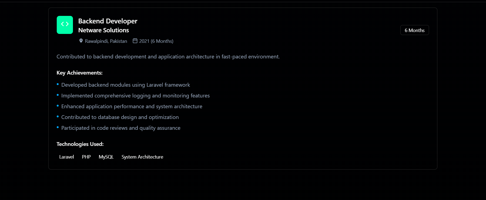

### 🔹 Education
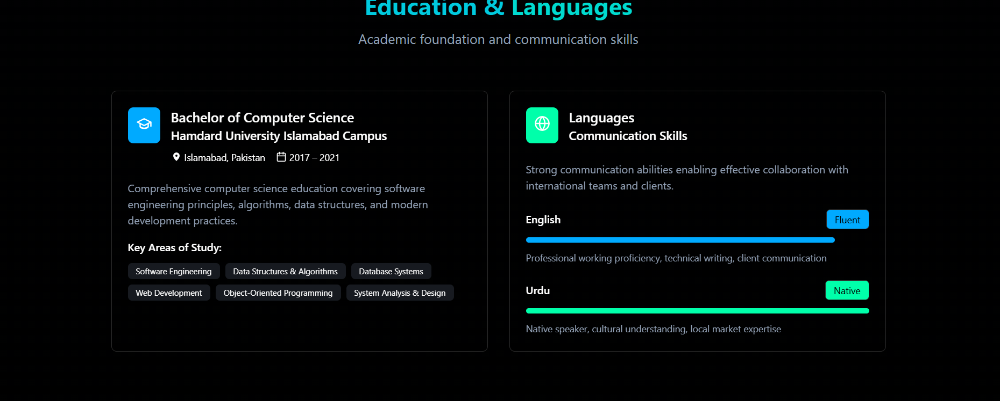

### 🔹 Contact
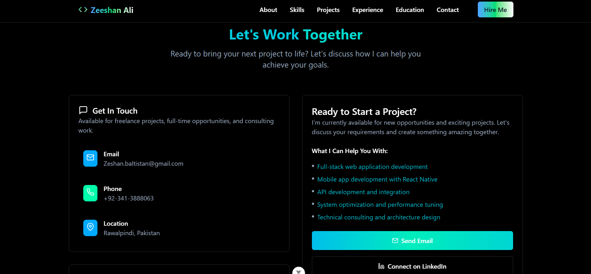  
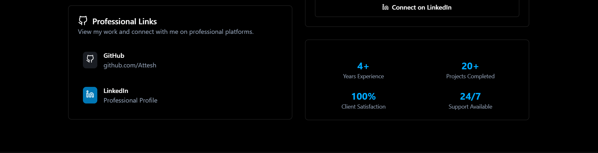

### 🔹 Footer


---

## 💡 Recommended IDE Setup

- [VSCode](https://code.visualstudio.com/)
- [Volar](https://marketplace.visualstudio.com/items?itemName=Vue.volar) (recommended over Vetur)

---

## ⚙️ Project Setup

Install dependencies:

```bash
npm install
